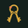

# KeepKeys favicon family

These repository-owned files are the canonical small-mark assets for the
[KeepKeys website](https://keepkeys.barnlabs.net/) and other surfaces that
support custom icons. GitHub renders them in Markdown and file views, but it
controls its own browser-tab favicon and does not offer a per-repository favicon
setting. See [GitHub's README documentation](https://docs.github.com/en/repositories/managing-your-repositorys-settings-and-features/customizing-your-repository/about-readmes).

T3 Code reads the repository-root `t3.json` and uses `icon-192.png` for the
KeepKeys project card instead of the generic folder icon.

| 16px | 32px | 48px | 192px |
| --- | --- | --- | --- |
|  |  |  |  |

`favicon-master.png` is the full two-key keeper's-ring mark used at 32px and
above. `favicon-micro-master.png` is the single-key optical version used only
for the 16px raster. Keeping those sources separate prevents the two-key mark
from collapsing into an ambiguous shape at browser-tab size.

The masters were generated with GPT ImageGen from the reviewed Keykeeper
artwork on 2026-08-01, then reduced to three exact colors:

- night pine `#14211D`;
- brass `#D9A83E`;
- coral `#E56F51`.

Use `favicon.ico` for a multi-resolution browser fallback, the size-specific
PNGs for explicit icon links, and `icon-maskable-512.png` for a maskable PWA
icon. `favicon-sizes.png` is the nearest-neighbor review sheet for the 16px,
32px, 48px, and large marks.
