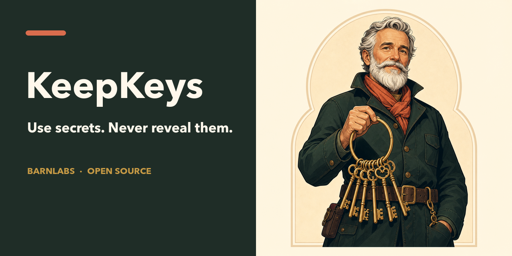

<p align="center">
  
</p>

<p align="center">
  <strong>You type the key once. Your agent can use it, never retrieve it.</strong>
</p>

<p align="center">
  <a href="https://github.com/barnlabs/keepkeys/actions/workflows/ci.yml"></a>
  <a href="LICENSE"></a>
  <a href="SECURITY.md"></a>
  
  
  
  
</p>

KeepKeys is the open-source, local secret-use broker for coding agents. It
opens a native secure-entry window, stores the value in the operating system's
credential vault, and gives the agent one narrow capability: run a specific
command with one named secret after you review the exact request.

There is no `get`, `show`, `copy`, reveal, or export tool. Friendly names,
environment-variable names, and descriptions remain reusable for future tasks;
the plaintext value does not.

## Why KeepKeys exists

An `.env` file gives every process that can read the file a reusable credential.
A general password-manager CLI commonly has a reveal path. A cloud agent vault
adds an account, network boundary, and service operator.

KeepKeys is deliberately narrower:

| Property | KeepKeys |
| --- | --- |
| At-rest storage | macOS Keychain, Windows Credential Manager, or Linux Secret Service |
| Secret entry | Native password field, never chat or terminal |
| Agent API | Store metadata, list metadata, remove, and approval-gated Run |
| Plaintext retrieval | No tool or helper action |
| Authorization | One native **Allow once** decision per command |
| Process scope | Empty child environment plus one approved variable |
| Executable identity | Canonical path and SHA-256, rechecked after approval |
| Interpreter identity | Detected script entrypoint gets a second SHA-256 |
| Output | Concurrent 1 MiB bounds and common-representation redaction |
| Service model | Local, offline, no KeepKeys account, cloud, daemon, or telemetry |

The distinction is simple: KeepKeys gives an agent use of a credential, not
possession of it.

## Native on all three desktop platforms

| Operating system | Secure store | Native human gate |
| --- | --- | --- |
| **macOS 13+** | Security.framework Keychain; device-only and non-synchronizing | AppKit secure text, replacement, removal, and command approval |
| **Windows 10/11** | paired metadata/value records in Windows Credential Manager | branded WPF `PasswordBox`, replacement, removal, and command approval |
| **desktop Linux** | paired metadata/value items in freedesktop Secret Service | branded Tk password, replacement, removal, and command approval |

Listing and the approval screen read only metadata. The protected value is
loaded after **Allow once**, metadata is checked again, and executable hashes
are rechecked immediately before launch.

Linux fails closed without a compatible Secret Service and graphical session.
It never falls back to a plaintext keyring, terminal password prompt, or file.

## One core contract, seven integrations

| Client | Package surface | Immutable install |
| --- | --- | --- |
| **Codex** | Codex plugin + BarnLabs marketplace | `codex plugin marketplace add barnlabs/keepkeys --ref cf6e9f0fc143785a1931577bbafe0feaa33a5fd4`<br>`codex plugin add keepkeys@barnlabs` |
| **Grok Build / Grok Code** | native Grok plugin | `grok plugin install 'barnlabs/keepkeys@cf6e9f0fc143785a1931577bbafe0feaa33a5fd4#plugins/keepkeys' --trust` |
| **Claude Code** | Claude plugin + pinned catalog | see [Install](INSTALL.md#claude-code) |
| **Oh My Pi** | OMP/Claude-compatible pinned catalog | see [Install](INSTALL.md#oh-my-pi) |
| **Hermes** | repository-root Hermes plugin | see [Install](INSTALL.md#hermes) |
| **Gemini CLI** | Gemini extension + Agent Skill | `gemini extensions install https://github.com/barnlabs/keepkeys --ref cf6e9f0fc143785a1931577bbafe0feaa33a5fd4` |
| **Agent Skills clients** | standard `skills/keepkeys/SKILL.md` | reviewed checkout or skills-only archive |

All integrations expose the same six tools and dispatch to the same
platform-native boundary:

- `keepkeys_store`
- `keepkeys_list`
- `keepkeys_remove`
- `keepkeys_run`
- `keepkeys_status`
- `keepkeys_doctor`

Claude Code and Oh My Pi use the immutable catalog at commit
`9a3da3b13ab441d46c0e447eb7e31f9bfd2aad19`; that catalog pins the functional
plugin source at `cf6e9f0fc143785a1931577bbafe0feaa33a5fd4`. See
[INSTALL.md](INSTALL.md) for copy-paste commands and platform prerequisites.

## What the user experiences

Store:

1. The agent supplies a friendly name such as `github-release`, a variable such
   as `GITHUB_TOKEN`, and a useful one-line description.
2. KeepKeys pre-fills all three.
3. The user types only the key into the branded native password field.
4. The operating system vault stores it.

Run:

1. The agent proposes an absolute executable, fixed argument list, purpose, and
   optional working directory.
2. KeepKeys displays the risk class, stored metadata, executable path, SHA-256,
   arguments, directory, environment scope, and detected script fingerprint.
3. The user chooses **Allow once** or **Cancel**.
4. Only after approval does KeepKeys load the value and run the direct child.

Remove always opens a native destructive-action confirmation and deletes the
complete named record. Uninstalling a client does not silently delete
credentials.

## The security promise—and its edge

KeepKeys does:

- keep plaintext out of model prompts, tool inputs/results, plugin metadata,
  argv, persistent environment, clipboard automation, and plaintext files;
- pin native helper sources and fail closed on integrity mismatch;
- block common shells, environment dumpers, and Windows dynamic script hosts;
- classify common network clients and interpreters visibly;
- compare metadata and executable identity again after approval;
- bound both output streams and omit a whole stream after overflow;
- run native-vault doctor tests with generated temporary values only.

KeepKeys does not:

- make an approved executable safe;
- confine a credential after delivery to that process or its descendants;
- detect arbitrary encryption, splitting, file writes, IPC, or network egress;
- protect against malware, a compromised signed-in account, administrator/root,
  debuggers, keyloggers, or modified local plugin code;
- promise forensic erasure inside operating-system-managed storage;
- claim to be unbreakable.

Read the complete [threat model](docs/threat-model.md), [privacy and data
handling](docs/privacy-and-data-handling.md), and [security policy](SECURITY.md)
before using KeepKeys for high-impact credentials.

## Development and proof

macOS or Linux:

```sh
./scripts/bootstrap
./scripts/check
./scripts/test
./scripts/doctor
```

Windows:

```powershell
.\scripts\bootstrap.ps1
.\scripts\check.ps1
.\scripts\test.ps1
.\scripts\doctor.ps1
```

CI runs the shared contract on macOS, Windows, and Ubuntu with Node.js 18 and
22. Separate jobs perform generated-value round trips through macOS Keychain,
Windows Credential Manager, and a disposable GNOME Keyring session. GitHub
Actions are pinned to exact upstream commits.

The repository has no runtime package dependencies. macOS compiles the reviewed
Swift helper with Apple Command Line Tools; Windows uses built-in Windows
PowerShell/.NET; Linux uses Python's standard library plus the desktop's
Secret Service tools and Tk.

## Project documents

- [Install, verify, upgrade, and remove](INSTALL.md)
- [Architecture](docs/architecture.md)
- [Compatibility matrix](docs/compatibility.md)
- [Threat model](docs/threat-model.md)
- [Privacy and data handling](docs/privacy-and-data-handling.md)
- [Security reporting](SECURITY.md)
- [Roadmap](ROADMAP.md)
- [Contributing](CONTRIBUTING.md)
- [Governance](GOVERNANCE.md)
- [Brand guidelines](plugins/keepkeys/assets/brand-guidelines.md)

## BarnLabs open source

KeepKeys is a BarnLabs open-source initiative, licensed under Apache-2.0. The
Keykeeper—an old steward carrying a real ring of keys—represents the product's
job: hold authority carefully, explain exactly where it is going, and hand over
only the one key needed for the approved task.

Security reports belong in a private GitHub Security Advisory. Product ideas
and reproducible bugs are welcome through the repository templates.
