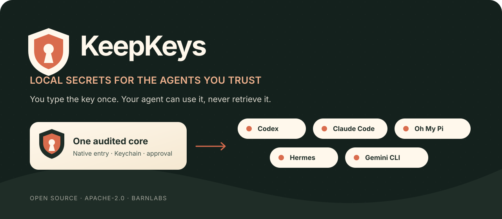

<p align="center">
  
</p>

<p align="center">
  <strong>You type the key once. Your agent can use it, never retrieve it.</strong>
</p>

<p align="center">
  <a href="https://github.com/barnlabs/keep-keys/actions/workflows/ci.yml"></a>
  <a href="LICENSE"></a>
  <a href="SECURITY.md"></a>
  
  
</p>

KeepKeys is the small, open-source secrets plugin for credentials you want a
local coding agent to use. It opens a native secure-entry window, stores the
value in macOS Keychain, and gives the agent one narrow capability: run a
specific command with one named secret after you approve the exact request.

There is no `get`, `show`, `copy`, reveal, or export tool. Friendly names,
environment-variable names, and descriptions are available for future tasks;
the plaintext value is not.

## One core, five native integrations

| Client | Native package surface | Install |
| --- | --- | --- |
| **Codex** | Codex plugin + BarnLabs marketplace | `codex plugin marketplace add barnlabs/keep-keys --ref 3bb6e306edc73270e96e25429ddf07861ad99ee3`<br>`codex plugin add keep-keys@barnlabs` |
| **Claude Code** | Claude plugin + source-pinned marketplace | `claude plugin marketplace add https://raw.githubusercontent.com/barnlabs/keep-keys/9713ee0bde0f29e1cc20a05094971ea34629678d/.claude-plugin/marketplace.json`<br>`claude plugin install keep-keys@barnlabs` |
| **Oh My Pi** | OMP/Claude-compatible, source-pinned marketplace | `omp plugin marketplace add https://raw.githubusercontent.com/barnlabs/keep-keys/9713ee0bde0f29e1cc20a05094971ea34629678d/.omp-plugin/marketplace.json`<br>`omp plugin install keep-keys@barnlabs` |
| **Hermes** | Repository-root Hermes plugin | [Install from the reviewed checkout](INSTALL.md#hermes) |
| **Gemini CLI** | Gemini extension + Agent Skill | `gemini extensions install https://github.com/barnlabs/keep-keys --ref 3bb6e306edc73270e96e25429ddf07861ad99ee3` |

All five integrations ship the same tool names and the same native core. The
repository also exposes a standard `skills/keep-keys/SKILL.md` for compatible
[Agent Skills](https://agentskills.io) clients. KeepKeys 0.2.0 is intentionally
**macOS-only**; it requires macOS 13+, Node.js 18+, and Apple Command Line
Tools.

The Claude and OMP commands pin the catalog itself to reviewed commit
`9713ee0bde0f29e1cc20a05094971ea34629678d`; that catalog pins its plugin source
to the functional commit above. See [INSTALL.md](INSTALL.md) for client-specific
setup, immutable Hermes installation, verification, upgrades, and removal.

## The promise—and its edge

KeepKeys does:

- pre-fill a friendly name, environment-variable name, and description so the
  user only types the key into the native secure field;
- store the value and metadata together as one non-synchronizing, device-local
  Keychain item;
- list names, variable names, and descriptions without reading values into the
  agent;
- show the executable, arguments, purpose, directory, variable name, and
  executable SHA-256 fingerprint before every use;
- clear the child environment, add the one approved variable, and execute the
  program directly without a shell;
- redact the exact value plus common base64, hexadecimal, URL-encoded, and
  JSON-escaped forms from bounded output;
- delete the complete named Keychain item—value and metadata—after a native
  confirmation.

KeepKeys does not:

- reveal plaintext secrets to a model or offer a retrieval API;
- store `.env` files, shell-profile variables, cloud-vault copies, or chat
  attachments;
- silently delete credentials when an integration is uninstalled;
- make an approved executable safe—the target and its descendants receive the
  secret;
- claim forensic overwrite of storage internally managed by macOS Keychain;
- protect a compromised macOS account, administrator, malicious approved
  executable, debugger, or keylogger.

Read the [threat model](docs/threat-model.md) before relying on a boundary that
is not named here.

## The six tools

| Tool | What the agent supplies | Native user gate |
| --- | --- | --- |
| `keepkeys_store` | name, variable, description | secure entry; confirmation before overwrite |
| `keepkeys_list` | nothing | none; returns metadata only |
| `keepkeys_run` | name, purpose, absolute executable, fixed arguments, optional directory | **Allow once** |
| `keepkeys_remove` | exact name | destructive confirmation |
| `keepkeys_status` | nothing | none; reads no credentials |
| `keepkeys_doctor` | nothing | synthetic write/read/delete only |

Typical requests:

> Store my deployment token as `cloudflare-production` using
> `CLOUDFLARE_API_TOKEN`; it deploys approved BarnLabs releases.

> Use `cloudflare-production` for this exact Wrangler command.

> Remove `cloudflare-production` from KeepKeys.

Never paste the value into the task. KeepKeys will open the native field when it
needs it.

## Architecture

```text
Codex · Claude Code · Oh My Pi · Gemini CLI     Hermes
                 │ MCP                           │ thin Python bridge
                 └──────────────┬────────────────┘
                                ▼
                   shared schema + fixed argv
                                ▼
              Swift / AppKit / Security.framework
              secure entry · approval · Keychain
                                ▼
                    one direct child process
```

The Node MCP server and Hermes bridge carry metadata and fixed argument vectors.
Keychain reads, secure entry, approval, deletion, execution, and redaction remain
in the Swift helper. The launcher verifies that helper source against a pinned
SHA-256 digest before compiling it into a private user cache.

See [architecture](docs/architecture.md), [compatibility and proof](docs/compatibility.md),
and [privacy/data handling](docs/privacy-and-data-handling.md).

## Build and verify

KeepKeys has no package dependencies and no application scaffold.

```sh
./scripts/bootstrap
./scripts/check
./scripts/test
./scripts/doctor
./scripts/package-release
```

- `check` validates every client manifest, shared schema, skill copy, Node and
  Python syntax, shell syntax, source digest, and native compilation.
- `test` runs MCP, Hermes, validation, execution-scope, and redaction contracts
  without reading user credentials or opening native UI.
- `doctor` performs one temporary Keychain write/read/delete round trip with a
  generated synthetic value.

## Project

- [Installation and upgrades](INSTALL.md)
- [Security policy](SECURITY.md)
- [Contributing](CONTRIBUTING.md)
- [Governance](GOVERNANCE.md)
- [Roadmap](ROADMAP.md)
- [Changelog](CHANGELOG.md)
- [Brand assets](plugins/keep-keys/assets/brand-guidelines.md)

KeepKeys is an Apache-2.0 [BarnLabs](https://github.com/barnlabs) open-source
initiative. Repository publication does not imply listing or approval in any
client’s official public directory; those review processes are separate.
